# Food Reality

**Food Reality** is an innovative online restaurant web application designed to enhance the dining experience by integrating Augmented Reality (AR) technology. This project allows customers to browse and purchase food items, view 3D models of the dishes, and place orders conveniently. The application is built with a strong focus on user-friendliness and aims to bridge the gap between virtual and physical dining experiences.

## Features

### Customer Module

- **Account Management:** Customers can register, log in, and manage their account details.
- **Browse Food Items:** View food items with detailed descriptions and 3D models using AR.
- **Add to Cart & Place Orders:** Seamlessly add items to the cart and place orders for delivery or pickup.
- **Order Tracking:** Track the status of orders from placement to delivery.
- **Order Reviews:** Provide feedback on delivered orders.

### Admin Module

- **User Management:** Manage customer accounts and delivery personnel.
- **Food Item Management:** Add, update, or delete food items and their categories.
- **Order Management:** View, update, and manage orders and their statuses.

### Augmented Reality (AR) Integration

- **AR Experience:** View realistic 3D models of food items in the customer's environment using their device's camera.
- **QR Code Access:** For desktop users, a QR code is provided to access the AR model on a supported mobile device.

## Technical Specifications

### Feasibility Reports

- **Technical Feasibility:** Utilizes widely adopted technologies like React, Flask, Three.js, WebAR, A-Frame, and PostgreSQL.
- **Operational Feasibility:** The application operates on both mobile and desktop platforms without requiring installations.
- **Economic Feasibility:** The use of free and open-source technologies ensures minimal development costs.
- **Schedule Feasibility:** The project is divided into modules with deadlines to ensure timely completion.
- **Specification Feasibility:** The project's requirements are well-defined and achievable within the given scope.

### Technologies Used

- **Frontend:** HTML, CSS, JavaScript (React)
- **Backend:** Flask (Python)
- **Database:** PostgreSQL
- **AR Technologies:** Three.js, WebAR, A-Frame
- **Deployment:** AWS (EC2, S3, RDS)

### Tools and Development Environment

- **Development:** VS Code, Git
- **Design:** Figma, StarUML
- **Documentation:** Microsoft Word, Excel

## Usage

### Customer Experience

- **Sign Up/Log In:** Access the application by registering an account.
- **Browse Menu:** Explore various food categories and view items in Augmented Reality.
- **Place Orders:** Add items to the cart and checkout for delivery or pickup.
- **Track Orders:** Monitor order status from the customer dashboard.
- **Leave Reviews:** Provide feedback on delivered orders.

### Admin Experience

- **Admin Dashboard:** Manage users, food items, categories, orders, and delivery personnel.
- **Order Management:** Oversee all orders and update their statuses as needed.

## Screenshots

### Home Page

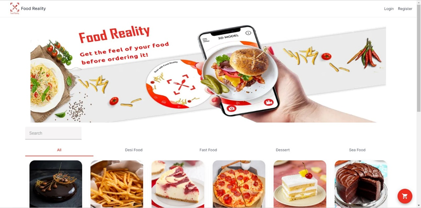

### Register

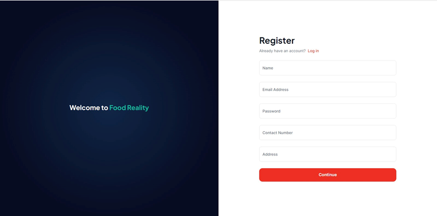

### Login

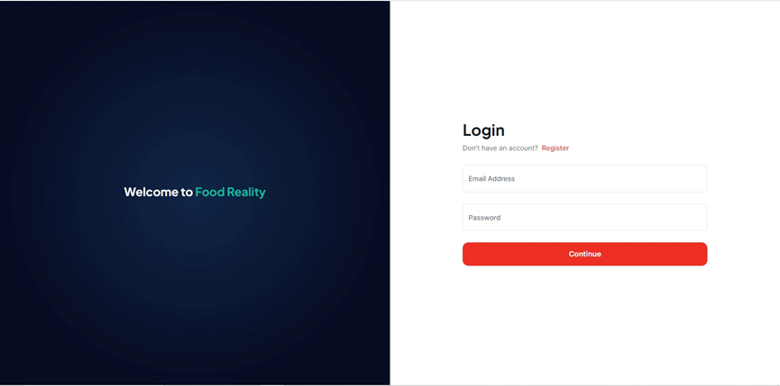

### Customer Home Page

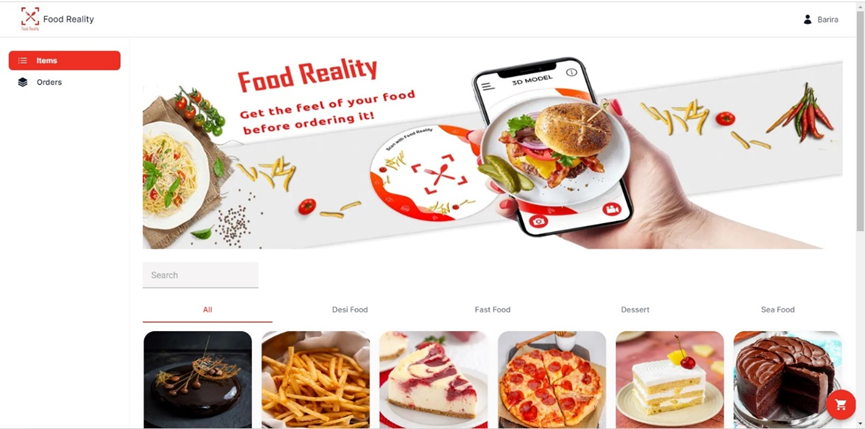

### Admin Main Page

### Users

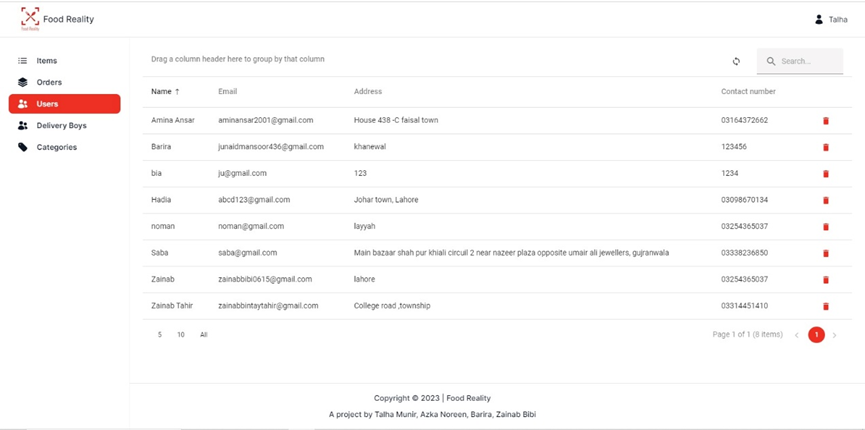

### Orders

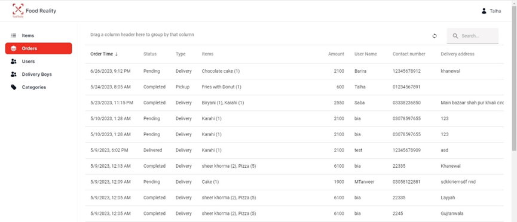

### Delivery Boys

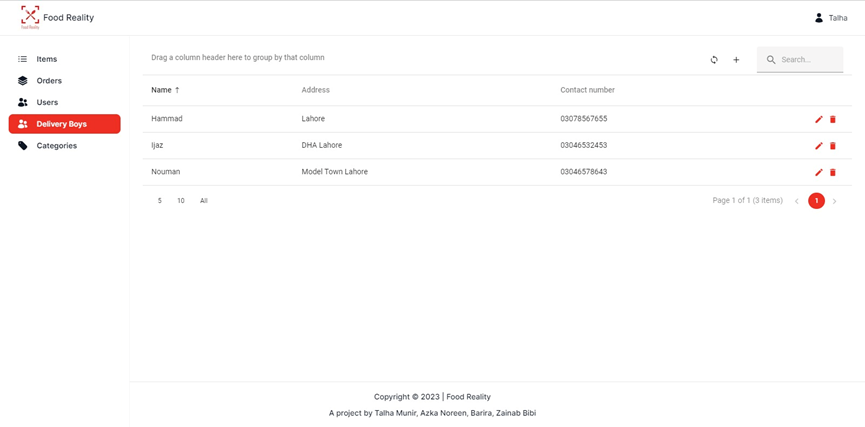

### Categories

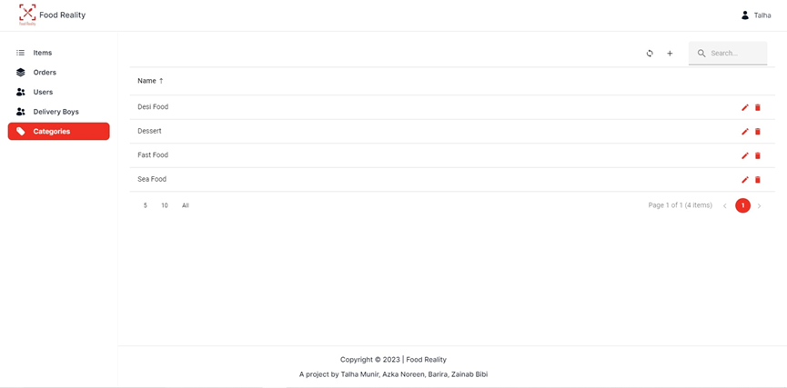

### Create Food Item

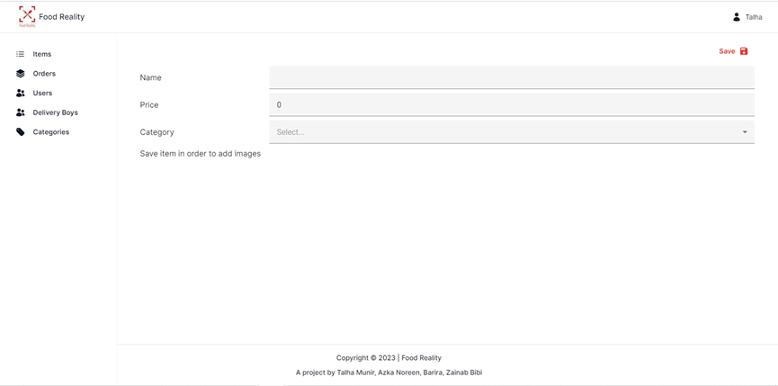

### View Food Item

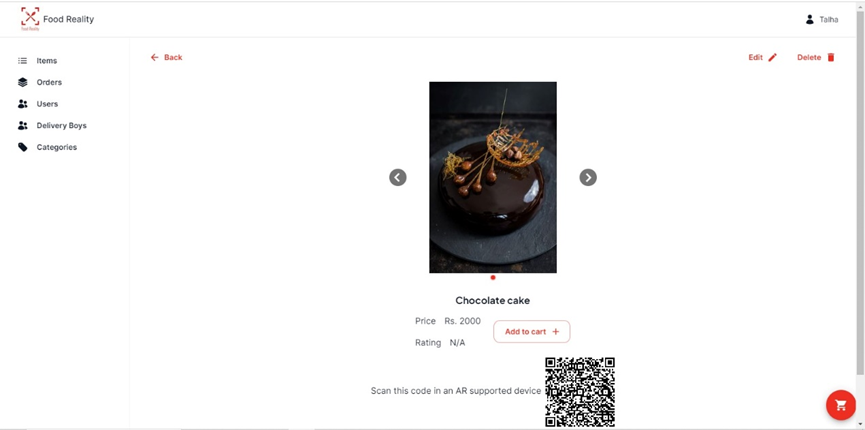

### Edit Food Item

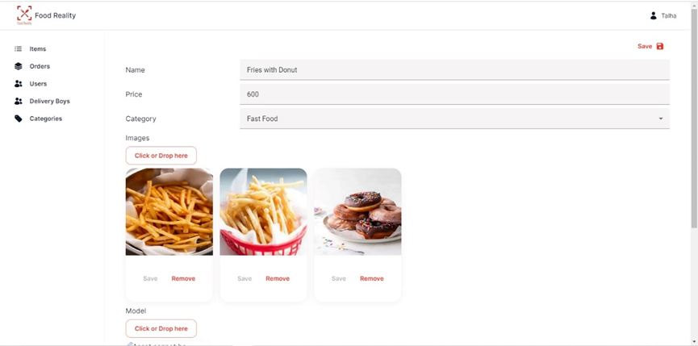

### Food Items in Augmented Reality

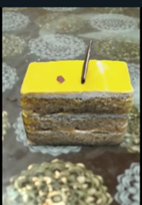

## Documentation

For a comprehensive understanding of the **Food Reality** project, including detailed design, architecture, use cases, and implementation, please refer to the complete documentation available in the repository: [Food Reality Documentation](Food%20Reality%20Documentation.pdf).

## Important Note

**This project is not open-source** and, therefore, the source code is not included in this repository. The project was developed as part of a final year project requirement.

## Conclusion

**Food Reality** aims to revolutionize the way customers interact with online food platforms by providing an immersive and user-friendly experience. Explore our innovative features and enjoy the convenience of modern dining.
